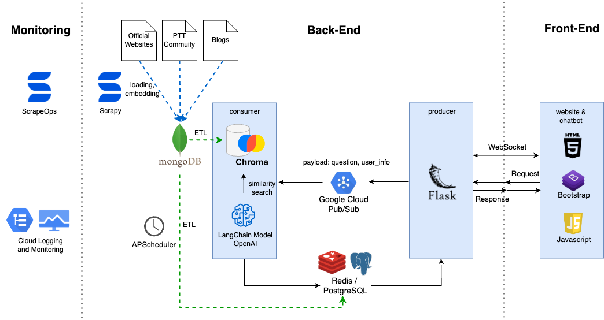
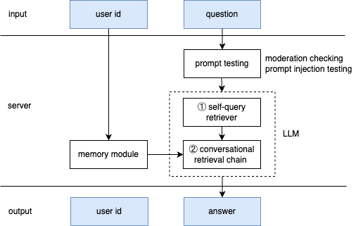
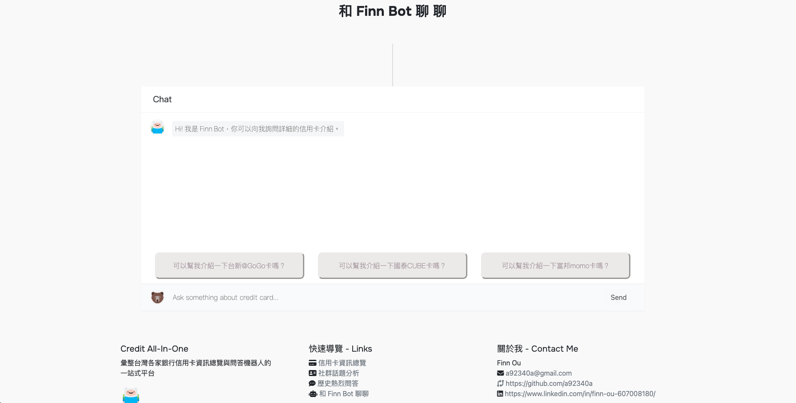

# Credit_All_In_One
One-stop credit card information service including brief card introduction between Taiwan's banks, trending topics analysis from PPT community (One of Taiwan's largest forum) and easy-use question-answer retriever with chatbot

Website: https://credit-all-in-one.com

  

## Table of Content
- [Problem Statement](#problem-statement)
- [Features](#features)
- [Architecture](#architecture)
- [Data Pipeline](#data-pipeline)
- [Live Demo](#live-demo)
- [Maintaince](#maintaince)
- [Technologies](#technologies)

## Problem Statement
Eager to improve the time-consuming and inflexible search challenges posed by large-scale data

## Features
- **銀行資訊總覽 Brief card introduction** summerizes card information from official websites and blogs. See the live demo: [銀行資訊總覽](#銀行資訊總覽-brief-card-introduction)
- **社群話題分析 Trending topics analysis** generates graphs and recent hot articles from 'creditcard' board of PTT community. See the live demo: [社群話題分析](#社群話題分析-trending-topics-analysis)
- **近期熱烈問答 Recent chatting records** shows latest 5 questions and answers for quick reviews. See the live demo: [近期熱烈問答](#近期熱烈問答-recent-chatting-records)
- **和 Finn Bot 聊聊 Question-answer retriever with chatbot** utilizes OpenAI and LangChain to provide a conversational chatbot service. See the live demo: [和 Finn Bot 聊聊](#和-finn-bot-聊聊-question-answer-retriever-with-chatbot)

## Architecture
### Overall Architecture

  

- Front-end:
    - Developed a Flask web service via Plotly graphing library, HTML, CSS/Bootstrap and JavaScript.
    - Established a one-to-one channel using the Socket.IO protocol to maintain a long-term connection between the server and client to sequentially chat with bot.
- Back-end:
    - Designed a conversational model via OpenAI and LangChain, integrating a dataset of over 360 card contexts and applying two-step generative AI approach to enhance the accuracy of retrieving credit card names. More about conversational model see [LLM Architecture](#llm-architecture)
    - Conducted a Pub/Sub message queue for receiving a large volume of questions from users, and ensured horizontal scalability for accommodating multiple consumers.  

### LLM Architecture

  

#### How does the LLM work in the server consumer?
1. input
    User's question with anonymous id 
2. server
- Propmt testing
Verify the user's question if it's inappropriate or malicious
    1. moderation checking: check the rating of 'sexual', 'hate', 'harassment', 'self-harm', 'sexual/minors', 'hate/threatening'
    2. prompt injection testing: check the user's intention utilizing the hugging face injection model
- Memory module
Retrieve the historical messages from MongoDB, and combine with user's standlone question this run
- LLM model
Implemented a two-step generative AI approach, involving inquiry-based and conversational models, to enhance the accuracy of retrieving credit card names.
    1. self-query retriever: build a structured query based on metadata construction
    2. conversational retrieval chain: generate a conversational response based on previous structured query 
3. output
    User's answer with anonymous id 

## Data Pipeline
### Crawling pipelines by ScrapeOps
- Implemented an automated pipeline system to collect data utilizing ScrapeOps from 25 distinct sources, including official websites, blogs and PTT community.
    
### ETL pipelines
- Fetch data of credit card from MongoDB to ChromaDB, embedding contexts to vectors 
- Fetch data of PTT community and .
Speeded up 3 data pipelines(xx,xx,xx) for querying credit card analysis by cache system, Redis, decreasing users’ waiting time by 20 seconds.

## Live Demo
### 銀行資訊總覽 Brief card introduction

  

### 社群話題分析 Trending topics analysis

  

### 近期熱烈問答 Recent chatting records

  

### 和 Finn Bot 聊聊 Question answer retriever with chatbot 

  

## Maintaince
### Unit test and Integretion test
- Implemented unit and integration tests to validate data transformation accuracy, and utilized GitHub Actions for continuous deployment, reducing the potential for human errors. 

### Real-time Monitoring 
Real-time logging and mo
    - Triggered spiders and monitored overall status of daily crawling pipelines through ScrapeOps scheduled jobs and dashboard.
    -  error handeling and notification

## Technologies