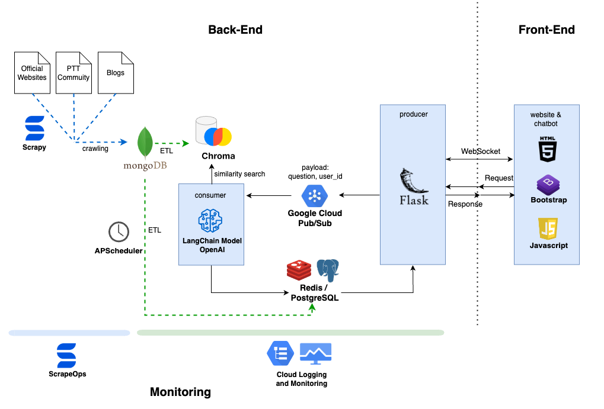
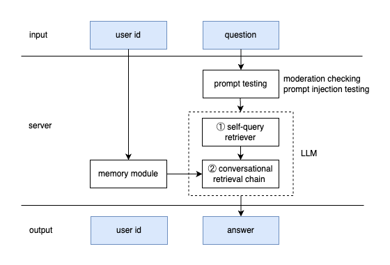

# Credit_All_In_One
One-stop credit card information service including brief card introduction between Taiwan's banks, trending topics analysis from the PTT community (One of Taiwan's largest forums) and easy-to-use question-answer retriever with chatbot

Website: https://credit-all-in-one.com

  

## Table of Content
- [Problem Statement](#problem-statement)
- [Features](#features)
- [Architecture](#architecture)
- [Data Pipeline](#data-pipeline)
- [Live Demo](#live-demo)
- [Maintenance](#maintenance)
- [Tools](#tools)

## Problem Statement
Eager to improve the time-consuming and inflexible search challenges posed by large-scale data

## Features
- **銀行資訊總覽 Brief card introduction** summarizes card information from official websites and blogs. See the live demo: [銀行資訊總覽](#銀行資訊總覽-brief-card-introduction)
- **社群話題分析 Trending topics analysis** generates graphs and recent hot articles from the 'creditcard' board of the PTT community. See the live demo: [社群話題分析](#社群話題分析-trending-topics-analysis)
- **近期熱烈問答 Recent chatting records** shows the latest 5 questions and answers for quick reviews. See the live demo: [近期熱烈問答](#近期熱烈問答-recent-chatting-records)
- **和 Finn Bot 聊聊 Question-answer retriever with chatbot** utilizes OpenAI and LangChain to provide a conversational chatbot service. See the live demo: [和 Finn Bot 聊聊](#和-finn-bot-聊聊-question-answer-retriever-with-chatbot)

## Architecture
### Overall Architecture

  

- Front-end:
    - Developed a Flask web service via Plotly graphing library, HTML, CSS/Bootstrap, and JavaScript.
    - Established a one-to-one channel using the Socket.IO to maintain a long-term connection between the server and client to sequentially chat with the bot.
- Back-end:
    - Designed a conversational model via OpenAI and LangChain, integrating a dataset of over 360 card contexts and applying a two-step generative AI approach to enhance the accuracy of retrieving credit card names. See [LLM Architecture](#llm-architecture) for more information about the conversational model.
    - Conducted a Pub/Sub message queue for receiving a large volume of questions from users, and ensured horizontal scalability for accommodating multiple consumers.  

### LLM Architecture

  

#### How does the LLM work in the server consumer?
1. Input  
    User's question with an anonymous ID 
2. Server
- Prompt testing  
Verify the user's question if it's inappropriate or malicious
    1. moderation checking: check the rating of 'sexual', 'hate', 'harassment', 'self-harm', 'sexual/minors', 'hate/threatening'
    2. prompt injection testing: check the user's intention utilizing the hugging face injection model
- Memory module  
Retrieve the historical messages from MongoDB, and combine them with the user's standalone question this run
- LLM model  
Implemented a two-step generative AI approach, involving inquiry-based and conversational models, to enhance the accuracy of retrieving credit card names.
    1. self-query retriever: build a structured query based on metadata construction
    2. conversational retrieval chain: generate a conversational response based on the previous structured query 
3. Output  
    User's answer with an anonymous ID 

## Data Pipeline

### Crawling pipelines by ScrapeOps
1. Implemented an automated pipeline system to collect data utilizing Scrapy Spiders from about 20 sources, including official websites, blogs and the PTT community.
2. Transformed and loaded data into MongoDB dispatched by Scrapy Engine.
    
### ETL pipelines
1. Fetch data of credit cards from MongoDB to ChromaDB, embedding contexts to vectors.
2. Fetch data of credit card from MongoDB to PostgreSQL for cleaned card dictionary and marked card alias name.
3. Fetch data of the PTT community from MongoDB to Redis, speeding up 3 data pipelines for querying credit card analysis by cache system and decreasing users’ waiting time by 20 seconds.

## Live Demo
### 銀行資訊總覽 Brief card introduction

  

### 社群話題分析 Trending topics analysis

  

### 近期熱烈問答 Recent chatting records

  

### 和 Finn Bot 聊聊 Question answer retriever with chatbot 

  

## Maintenance
### Unit tests and Integration tests
Implemented unit and integration tests to validate data transformation accuracy, and utilized GitHub Actions for continuous deployment, reducing the potential for human errors. 

### Real-time Monitoring 
1. Monitored the overall status of daily crawling pipelines through ScrapeOps scheduled jobs and dashboard.  

  

2. Ensured the ETL pipelines running robustly and alerted by email as detecting the error message.
3. Traced health status of instances, database, and cloud services like Pub/Sub by dashboard of Cloud Monitoring.

## Tools
> **Cloud services**  
GCP: Compute Engine, Pub/Sub, Cloud SQL, Cloud Storage, Cloud Logging and Monitoring

> **Programming Language**  
Python, HTML, CSS/Bootstrap, JavaScript

> **Databases**  
MongoDB, PostgreSQL, Redis

> **Automation**  
ScrapeOps, GitHub Actions with CI / CD
